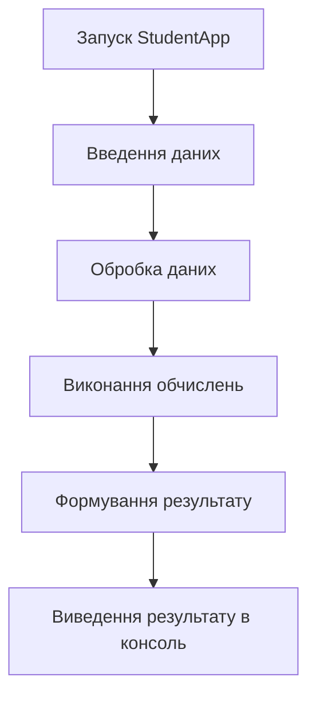

# 🎓 StudentApp — Студентський додаток


**StudentApp** — простий консольний застосунок на **C#**, створений у межах навчальної практики з програмування.

Проєкт призначений для виконання базових обчислень та обробки масивів даних. Його мета — практичне застосування основ програмування, роботи з даними та командного рядка.

---

## 📌 Зміст

* [Можливості](#-можливості)
* [Використані технології](#-використані-технології)
* [Встановлення](#-встановлення)
* [Використання](#-використання)
* [Приклад роботи](#-приклад-роботи)
* [Структура проєкту](#-структура-проєкту)
* [Принцип роботи](#-принцип-роботи)
* [Ліцензія](#-ліцензія)
* [Автор](#-автор)

---

## ✨ Можливості

Застосунок демонструє базові можливості програмування мовою C#:

* виконання простих математичних обчислень;
* робота з масивами даних;
* обробка та виведення результатів;
* використання змінних і операторів;
* робота з консоллю;
* застосування базових конструкцій мови C#.

---

## 🛠 Використані технології

| Технологія  | Призначення                          |
| ----------- | ------------------------------------ |
| **C#**      | Основна мова програмування           |
| **.NET**    | Платформа для запуску застосунку     |
| **Console** | Взаємодія з користувачем             |
| **Git**     | Система контролю версій              |
| **GitHub**  | Зберігання та публікація репозиторію |

---

## 📥 Встановлення

Для роботи з проєктом необхідно мати встановлений **.NET SDK**.

### 1. Клонування репозиторію

Відкрийте термінал та виконайте:

```bash
git clone https://github.com/annasacuk27-cmd/StudentApp.git
```

Перейдіть до папки проєкту:

```bash
cd StudentApp
```

### 2. Перевірка встановлення .NET

```bash
dotnet --version
```

Якщо команда повертає номер версії, середовище готове до роботи.

### 3. Відновлення залежностей

```bash
dotnet restore
```

---

## ▶️ Використання

Для запуску застосунку використайте команду:

```bash
dotnet run
```

Після запуску програма працює в консолі та виконує передбачені програмою операції з даними.

Для збирання проєкту без запуску використайте:

```bash
dotnet build
```

---

## 💻 Приклад роботи

Приклад взаємодії з консольним застосунком:

```text
=== StudentApp ===

Введіть дані для обробки:
10 20 30 40 50

Результат:
Масив: 10 20 30 40 50
Кількість елементів: 5
```

> Конкретний результат залежить від реалізації програми та введених користувачем даних.

---

## 📁 Структура проєкту

Основна структура проєкту:

```text
StudentApp/
│
├── README.md
├── LICENSE
├── StudentApp.csproj
└── Program.cs
```

### Опис файлів

* `README.md` — документація проєкту.
* `Program.cs` — основний файл програми.
* `StudentApp.csproj` — файл конфігурації C#/.NET проєкту.
* `LICENSE` — інформація про ліцензію.

---

## 🔄 Принцип роботи



Схема демонструє загальний порядок роботи програми: користувач вводить дані, програма їх обробляє, виконує необхідні операції та виводить результат.

---

## 📸 Приклад зображення


)


---

## 📜 Ліцензія

Цей проєкт створено **в навчальних цілях**.

Проєкт поширюється за ліцензією **MIT**. Повний текст ліцензії знаходиться у файлі [LICENSE](LICENSE).

---

## 👩‍💻 Автор

**Anna Sacuk**

GitHub: [@annasacuk27-cmd](https://github.com/annasacuk27-cmd)

Репозиторій проєкту:
[StudentApp](https://github.com/annasacuk27-cmd/StudentApp)

---

## 📌 Навчальна інформація

Проєкт виконано в межах практичної роботи з дисципліни **«Програмне забезпечення ПК»**.

Основна мета роботи — ознайомлення з:

* Markdown;
* структурою `README.md`;
* документацією програмних проєктів;
* Git та GitHub;
* оформленням репозиторію;
* базовою документацією коду.

---

## 🚀 Основні Git-команди

Для оновлення README у репозиторії:

```bash
git add README.md
git commit -m "Add project documentation"
git push
```
